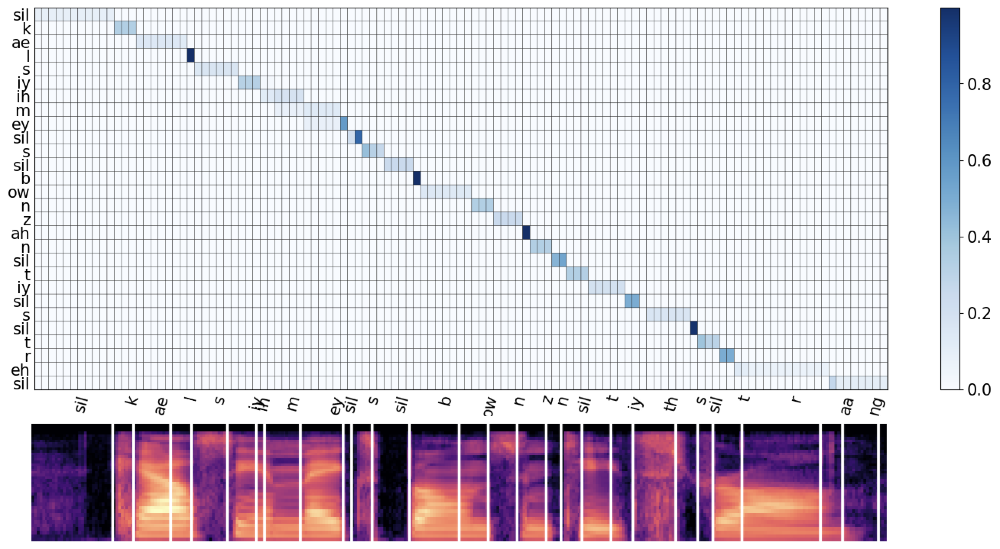

### Unsupervised Speech Recognition with N-Skipgram and Positional Unigram Matching
<div align="left"></div>
<div align="left"></div>
<div align="left"></div>

# Dependencies
- [fairseq](https://github.com/pytorch/fairseq) >= 1.0.0 with dependencies for [wav2vec-u](https://github.com/pytorch/fairseq/tree/main/examples/wav2vec/unsupervised)
- [UnsupSeg (my fork)](https://github.com/lwang114/UnsupSeg)
- [self-supervised-segmentation (my fork)](https://github.com/lwang114/self-supervised-phone-segmentation) 

# How to run it?
1. Extract unsupervised phoneme segmentation by running
```
bash run_segment.sh
```
2. Run ASR-U experiments:
```
bash run.sh
``` 
